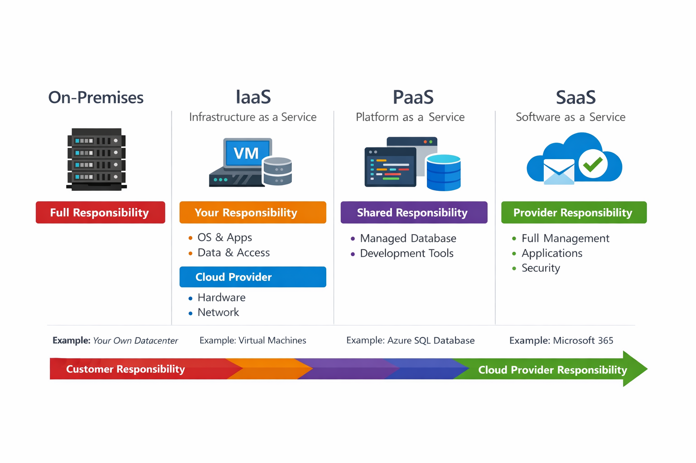

# 🔐 Shared Responsibility Model – Kurz & Knackig

## Definition:
Verantwortung wird zwischen Kunde und Microsoft (Cloud Provider) aufgeteilt

---
## ⚖️ Grundprinzip
### On-Premises:
👉 Du bist für alles verantwortlich
### Cloud:
👉 Verantwortung wird geteilt
---
## 🧠 Wer macht was?
### ☁️ Cloud Provider (immer verantwortlich)
- Physisches Rechenzentrum
- Netzwerk (physisch)
- Server/Hosts
- Strom, Kühlung, Sicherheit
---
### 👤 Kunde (immer verantwortlich)
- Daten & Informationen
- Zugriffsrechte (Identity, Accounts)
- Endgeräte (Laptop, Smartphone)
---
## 🔄 Abhängig vom Service-Modell

👉 Wichtig für Prüfung!
| Modell   | Description                 | Verantwortung                        |
| -------- | --------------------------- | ------------------------------------ |
| **IaaS** | Infrastructure as a Service | Kunde macht viel (OS, Apps, Updates) |
| **PaaS** | Platform as a Service       | Geteilt                              |
| **SaaS** | Software as a Service       | Provider macht fast alles            |

---
## ⚡ Beispiele (sehr wichtig)
### VM (IaaS):
-  👉 Du patchst OS + Software
---
### Managed DB (PaaS):
- 👉 Provider managed DB
- 👉 Du verantwortest Daten
---
### 📌 Merksätze
- 👉 „You own your data – always“
- 👉 Je mehr managed (SaaS), desto weniger Verantwortung
- 👉 IaaS = meiste Verantwortung beim Kunden
---
### 🎯 Prüfungsfokus
- Wer ist verantwortlich für Daten? → IMMER Kunde
- Wer ist verantwortlich für Hardware? → IMMER Provider
- Unterschied IaaS / PaaS / SaaS
---
[Cloud Concepts](README.md)
---
### Navigation
- [Parent: Module Overview](README.md)
- [Previous: ☁️ Cloud Computing – Kurz & Knackig](10_define_cloud_computing.md)
- [Next: ☁️ Cloud Models – Kurz & Knackig](30_cloud_models.md)
- [Home](../../README.md)

