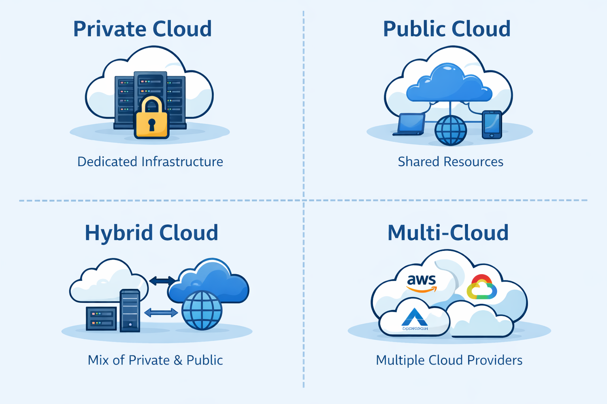

# ☁️ Cloud Models – Kurz & Knackig

## Definition:

- Beschreiben, wie Cloud-Ressourcen bereitgestellt werden
- 3 Hauptmodelle:
  - Public
  - Private
  - Hybrid

# 🌍 Public Cloud
- Von Provider (z. B. Microsoft) betrieben
- Für alle zugänglich
- Pay-as-you-go
- Schnell skalierbar

## 👉 Nachteile:
- Weniger Kontrolle
- Ressourcen werden geteilt (Multi-Tenant)
---
# 🏢 Private Cloud
- Nur für eine Organisation
- Höchste Kontrolle & Sicherheit
- Kann On-Prem oder extern gehostet sein

## 👉 Nachteile:
- Teuer
- Wartung liegt bei dir
- Weniger flexibel
- 
# 🔀 Hybrid Cloud
Kombination aus Public + Private
Daten/Apps flexibel verteilen

## 👉 Vorteile:
- Maximale Flexibilität
- Bursting möglich (Lastspitzen → Public Cloud)
- Kontrolle über sensible Daten

# 🌐 Multicloud
- Nutzung von mehreren Cloud-Anbietern
- z. B. Azure + AWS

## 👉 Gründe:
- Migration
- Spezial-Features nutzen
- Risiko verteilen

# 🛠️ Wichtige Azure-Tools
- ## 🔧 Azure Arc
- Einheitliches Management:
  - Public
  - Private
  - Hybrid
  - Multicloud
  
## 🖥️ Azure VMware Solution
- VMware Workloads in Azure betreiben
- Einfacher Übergang in die Cloud

# ⚡ Prüfungsvergleich (sehr wichtig)
| Modell            | Beschreibung                                                                                | Vorteile                                                                        | Nachteile                                            | Beispiele                                                            |
| ----------------- | ------------------------------------------------------------------------------------------- | ------------------------------------------------------------------------------- | ---------------------------------------------------- | -------------------------------------------------------------------- |
| **Private Cloud** | Infrastruktur wird **nur von einer Organisation** genutzt (on-prem oder dediziert gehostet) | - Hohe Kontrolle - Höhere Sicherheit - Anpassbar                          | - Teuer - Wartungsaufwand - Weniger Skalierung | - Eigenes Rechenzentrum - Dedizierte Umgebung bei Microsoft Azure |
| **Public Cloud**  | Ressourcen werden von einem **Cloud-Anbieter öffentlich bereitgestellt**                    | - Skalierbar - Pay-as-you-go - Kein Wartungsaufwand                       | - Weniger Kontrolle - Shared Environment          | - Microsoft Azure - Amazon Web Services (AWS) - Google Cloud   |
| **Hybrid Cloud**  | Kombination aus **Private + Public Cloud** (verbunden)                                      | - Flexibel - Sensible Daten bleiben privat - Skalierung über Public Cloud | - Komplexer Betrieb - Integration nötig           | - On-Prem + Azure - Backup in Public Cloud                        |
| **Multi-Cloud**   | Nutzung von **mehreren Cloud-Anbietern gleichzeitig**                                       | - Kein Vendor Lock-in - Best-of-Breed Services - Höhere Ausfallsicherheit | - Sehr komplex - Mehr Know-how nötig              | - Azure + AWS parallel - AWS für Storage, Google Cloud für AI     |

# 🧠 Merksätze
- 👉 Public = teilen & flexibel
- 👉 Private = Kontrolle & teuer
- 👉 Hybrid = Best of both worlds
- 👉 Multicloud = mehrere Anbieter
  
# 🎯 Typische Prüfungsfragen
- „Maximale Kontrolle?“ → Private Cloud
- „Keine Hardware kaufen?“ → Public Cloud
- „Flexibel zwischen beiden?“ → Hybrid Cloud
- „Mehrere Anbieter?“ → Multicloud

---
[Cloud Concepts](README.md)
---
### Navigation
- [Parent: Module Overview](README.md)
- [Previous: 🔐 Shared Responsibility Model – Kurz & Knackig](20_shared_responsibility_model.md)
- [Next: Cloud Models – Use Cases](40_cloud_models_use_cases.md)
- [Home](../../README.md)

